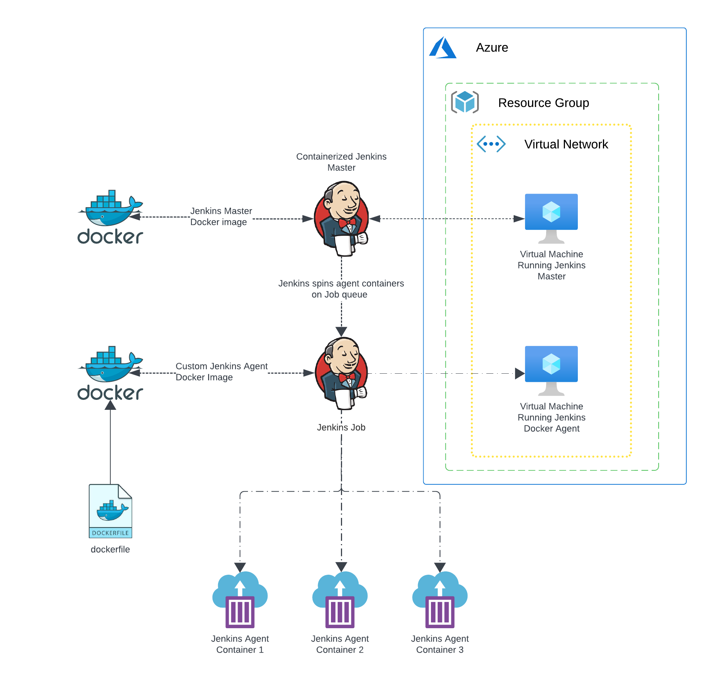
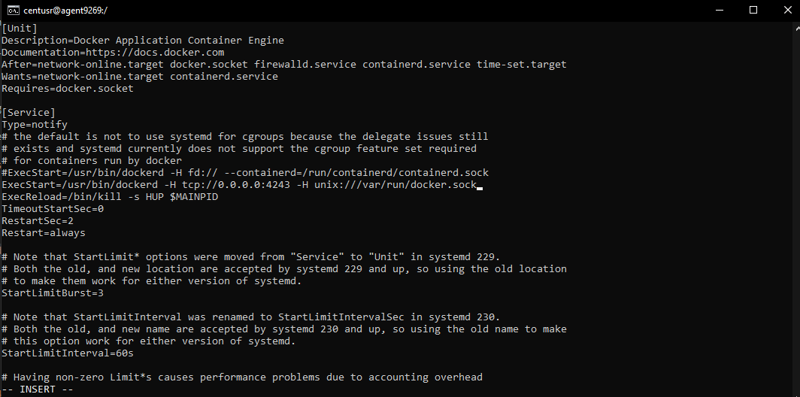
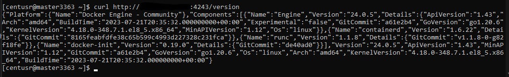
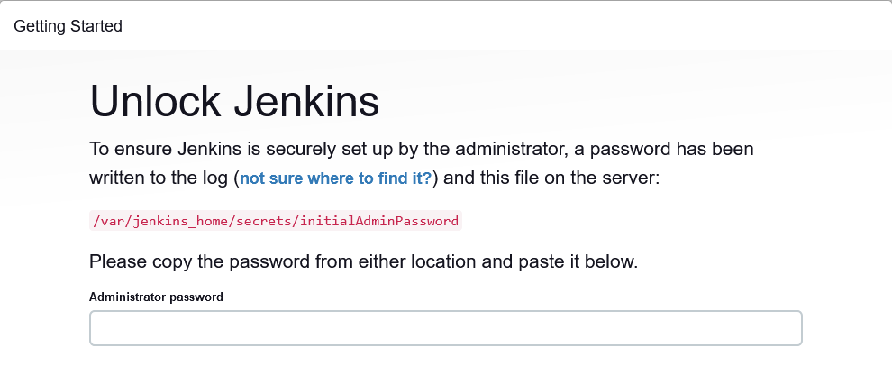
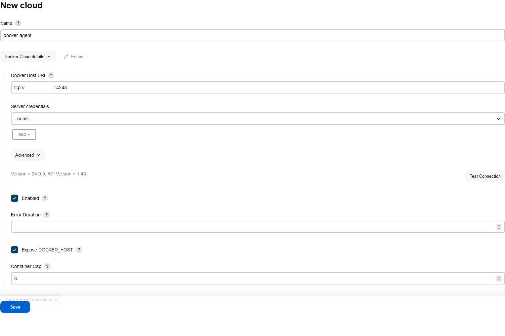
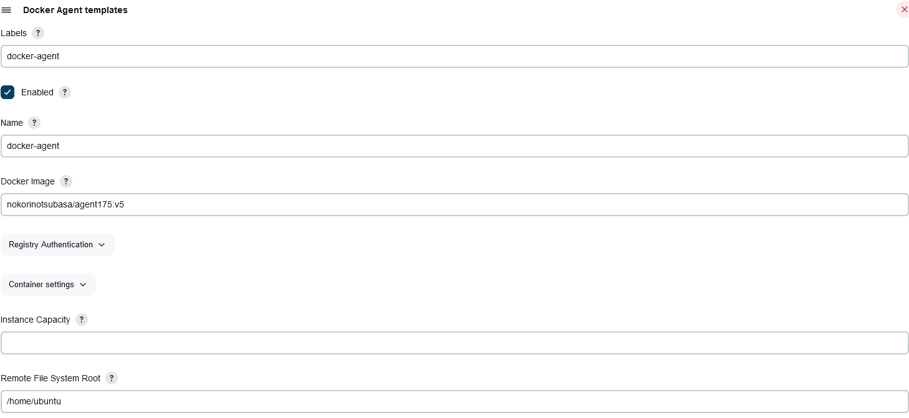
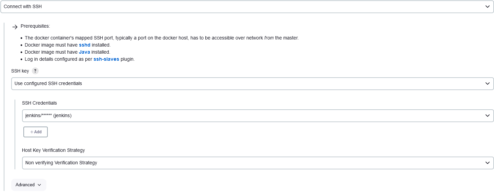
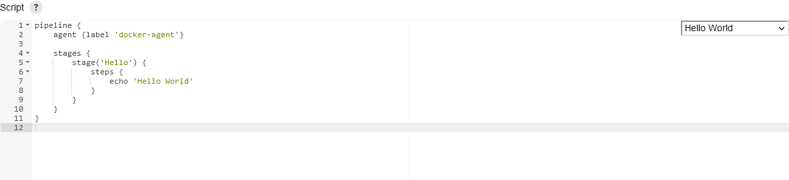
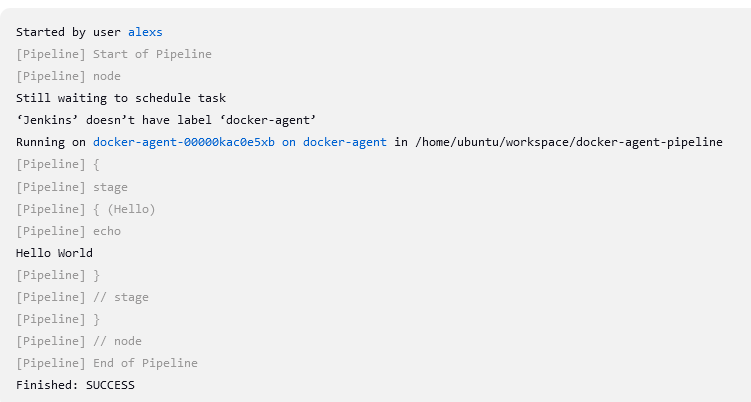

# Jenkins Docker container agent

## Table of Contents
- [Introduction](#introduction)
- [Notes about Terraform](#notes-about-terraform)
- [Prerequisites](#prerequisites)
- [Steps](#steps)
  - [Deploy Resources](#deploy-resources)
  - [Configure Docker on Agent VM](#configure-docker-on-agent-vm)
  - [Install Jenkins and Docker Plugin](#install-jenkins-and-docker-plugin)
  - [Configure Jenkins Cloud](#configure-jenkins-cloud)
  - [Configure Docker Agent Template](#configure-docker-agent-template)
  - [Configure Pipeline](#configure-pipeline)
  - [Verify Setup](#verify-setup)
- [Cloud Statistics](#cloud-statistics)

## Introduction

Here we will learn how to spin up a Docker container as a Jenkins build agent.



We will use terraform for resource deployments.

Terraform will deploy all the resources required, including two Vms, one which will run Jenkins on a Docker container; the other will run the Docker agent container.

Both Vms have script extensions to configure basic dependencies upon creation.

The Docker agent container will use a custom Docker image; the dockerfile can be found in this repository.

## Notes about Terraform

- Don't forget to change `terraform.tfvars` to set vm admin username, etc.;

- The Virtual machines password will NOT be on the output, instead they can be securely found in the `terraform.tfstate` file;

## Prerequisites

Before you begin, ensure you have the following:

* Terraform installed.
* A Docker Hub account (or other Docker registry) 
_if you plan to use custom Docker images._

## Steps

### Deploy Resources

1.  **Deploy the resources using Terraform.**
    *   Don't forget to change `terraform.tfvars` to set VM admin username, etc.
    *   The Virtual Machine passwords will NOT be in the output; they can be securely found in the `terraform.tfstate` file.

### Configure Docker on Agent VM

2.  **Edit the `docker.service` file on the `agentVm` to open port `4243` for TCP connections.**
    *   Navigate to the correct directory: `usr/lib/systemd/system/`.
    *   Open the `docker.service` file for editing:
        ```bash
        sudo vi /usr/lib/systemd/system/docker.service
        ```
    *   Modify the `ExecStart` line to include the TCP host:
        `ExecStart=/usr/bin/dockerd -H tcp://0.0.0.0:4243 -H unix:///var/run/docker.sock`

    

3.  **Restart Docker services:**
    ```bash
    sudo systemctl daemon-reload
    sudo systemctl restart docker
    ```

4.  **Test the connection from the `masterVm` (or another VM on the same network):**
    ```bash
    curl http://<agentvmip>:4243/version
    ```
    
    > `the ip was censored`

### Install Jenkins and Docker Plugin

5.  **Proceed with the basic Jenkins installation on the `masterVm`.**
    *   You will need to install the **Docker plugin**.

    
    > `masterVm running Jenkins master`

### Configure Jenkins Cloud

6.  **Navigate to `Manage Jenkins > Clouds` and add a new cloud of type Docker.**

7.  **Configure the Docker Host URL.**
    *   In the "Docker Host URI" field, insert the agent VM URL:
        `tcp://<agentvmIp>:4243`

    
    > `the ip was censored`
    *   Test the connection.
    *   Enable the configuration.
    *   Ensure "Expose DOCKER_HOST" is checked if needed by your jobs.

8.  **Set the container cap (the maximum number of concurrent containers Jenkins can run).**

### Configure Docker Agent Template

9.  **In the Docker Cloud configuration, go to "Docker Agent Templates" and add a new template.**

10. **Set the Label and Name for the template.** This label will be used in your Jenkins jobs to specify that they should run on an agent from this template.

11. **Configure the Docker Image.**
    *   For the "Docker Image" option, specify the image you want to use. In this example, a custom Docker image is used:
        `nokorinotsubasa/agent175:v5`

12. **Set the "Remote File System Root" to `/home/ubuntu` (or the appropriate home directory inside your agent container).**

    

13. **Configure the Connection Method.**
    *   Choose "Connect with SSH".
    *   For "SSH Key," select "Use configured SSH credentials."

14. **Add Credentials.**
    *   Click "Add" next to "Credentials" and choose "Username with password."
    *   Set Username to `jenkins` and Password to `jenkins`. (These credentials were defined in the custom Docker image used for the agent).

15. **Set Host Key Verification Strategy.**
    *   Choose "Non-verifying Verification Strategy."
    > **Caution:** This is not recommended for production environments and is used here for demonstration purposes only.

    
    > `final configuration`

### Configure Pipeline

16. **Configure your Jenkins job to use the Docker agent.**
    *   **For a Freestyle project:**
        *   In the project configuration, check "Restrict where this project can be run."
        *   Enter the label you defined in the Docker Agent Template (e.g., `docker-agent`).
    *   **For a Pipeline script:**
        *   Use the `agent` directive with the label:
          ```groovy
          agent {
              label 'your-label-name' // Replace 'your-label-name' with the actual label
          }
          ```
    *   E.g.
        

### Verify Setup

17. **Run your Jenkins job.**
    *   You should see a new Docker container being deployed on the `agentVm`.
    *   The pipeline will run inside this container.
    *   After the job completes, the container should be automatically destroyed.

    
    > `Running on docker-agent-00000kac0e5xb on docker-agent in /home/ubuntu/workspace/docker-agent-pipeline`

## Cloud Statistics

- If you head into `Cloud statistics`, you can check some information on the agents:


